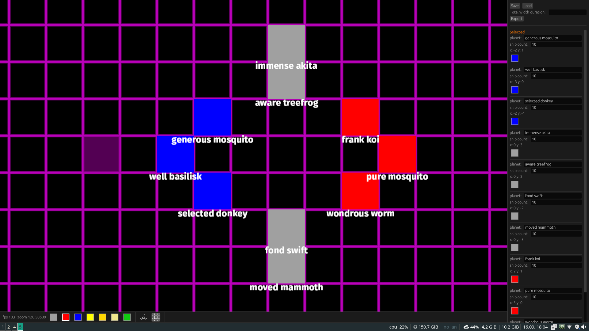
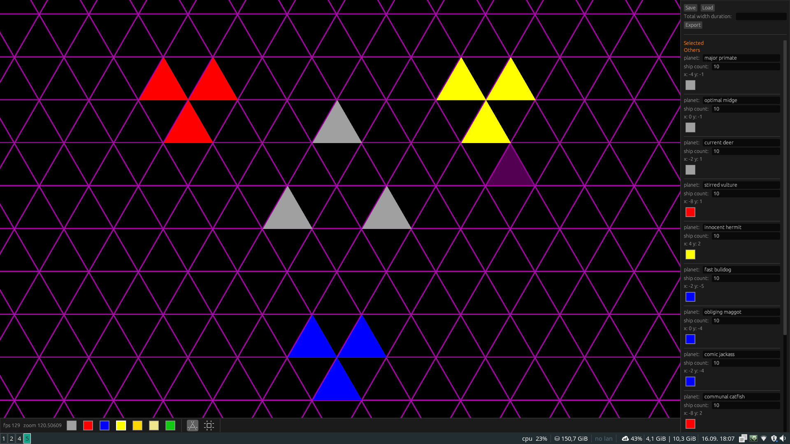

# pw-mapbuilder

## Run mapbuilder

> cargo run --bin mapbuilder

## Usage

Change layout with the `z` and `x` keys, or by clicking the buttons below.
Move the worlds with `wasd keys` or `arrow keys`.
Place a planet for the currently selected player with the left mouse button. 
Delete a planet with the right mouse button.

When you select a planet on the right sidepanel, you can:
- change the name
- change the number of ships that planet will start with
- change the player that owns that planet

Keep track of your map with the save and load buttons.
Once ready, click export, now copy the JSON object and yell at @iason.

## Screen shots

---

